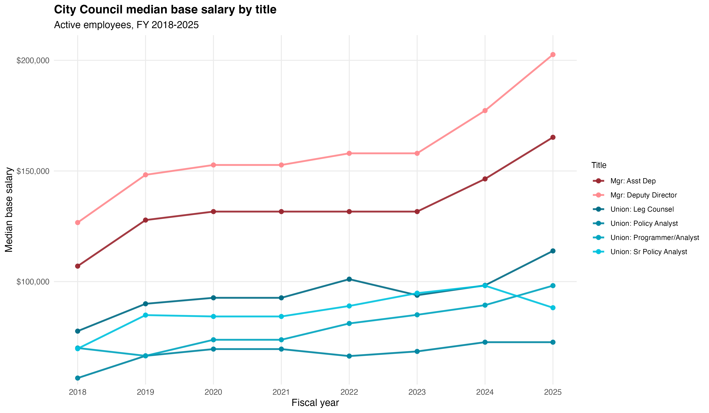

```{r setup, include=FALSE}
knitr::opts_chunk$set(
  echo = FALSE,
  warning = FALSE,
  message = FALSE,
  fig.width = 7,
  fig.height = 4,
  dpi = 300
)

library(data.table)
library(ggplot2)
library(scales)
library(stringr)
library(gt)
library(rmarkdown)

gt_theme_journal <- function(tbl) {
  tbl %>%
    gt::opt_table_lines(extent = "none") %>%
    gt::tab_options(
      table.width = gt::pct(100),
      table.font.size = gt::px(12),
      data_row.padding = gt::px(2),
      column_labels.font.weight = "bold",
      column_labels.border.top.width = gt::px(1),
      column_labels.border.bottom.width = gt::px(1),
      table.border.top.width = gt::px(1),
      table.border.bottom.width = gt::px(1)
    )
}

gt_pdf_fix <- function(tbl) {
  tbl <- gt_theme_journal(tbl)
  if (knitr::is_latex_output()) {
    tbl %>%
      gt::tab_options(
        latex.use_longtable = TRUE,
        table.width = gt::pct(100),
        table.font.size = gt::px(12)
      )
  } else {
    tbl
  }
}

# Resolve project root if available; otherwise use current working directory.
root_dir <- rprojroot::find_root(rprojroot::has_file("proposal.Rproj"))

# Inputs (use project data/ paths if present; otherwise fall back to attached file paths)
cc_active_path <- 
  file.path(root_dir, "data", "active_city_council_2018-2025.csv")


fy25_active_path <- file.path(root_dir, "data", "fy25_sal_active.csv")


attr_path <- file.path(root_dir, "data", "salary_data_2018-2025_attrition.csv")


# Load
cc_active <- fread(cc_active_path)
fy25 <- fread(fy25_active_path)
attr <- fread(attr_path)

# Basic cleaning
cc_active[, fiscal_year := as.integer(fiscal_year)]
cc_active[, base_salary := as.numeric(base_salary)]

fy25[, fiscal_year := as.integer(fiscal_year)]
fy25[, base_salary := as.numeric(base_salary)]
fy25[, years_exp := as.numeric(years_exp)]

attr[, fiscal_year := as.integer(fiscal_year)]
attr[, base_salary := as.numeric(base_salary)]
attr[, years_exp := as.numeric(years_exp)]
```

# Supporting Data Analysis for Proposal 

This report provides the analytical reasoning, using publicly available data, for the Bargaining Unit's economic demands in the proposal. We use current job posting data to find comparable City titles (via job descriptions), civil service title data for our basis of salary differentials across title levels, and salary data to show both the widening distance between Council and City pay and within Council pay disparities between managerial and bargaining unit titles. 

Our proposed minimum and maximum salaries sit within the comparable City title ranges. The analysis shows that City salaries increase more consistently with tenure, while Council salary growth flattens earlier and staff leave the Council sooner. 

The proposed salary minimums better reflect the work we do at the Council, and the proposed tenure-based step system provides structured salary progression that will increase pay parity with City employees performing comparable work. 


## Managers vs bargaining unit titles (City Council legislative division, active staff)

```{r cc_mgr_bu_gap, include=FALSE}
# Median base salary by year and group (BU vs Manager)
trend <- cc_active[
  !is.na(base_salary) & base_salary > 0 & group %in% c("bu", "manager"),
  .(median_salary = median(base_salary, na.rm = TRUE)),
  by = .(fiscal_year, group)
]

trend_w <- dcast(trend, fiscal_year ~ group, value.var = "median_salary")
setorder(trend_w, fiscal_year)

# Summary deltas (2018 -> 2025)
fy_min <- 2018L
fy_max <- 2025L
bu_incr <- trend_w[fiscal_year == fy_max, bu] - trend_w[fiscal_year == fy_min, bu]
mgr_incr <- trend_w[fiscal_year == fy_max, manager] - trend_w[fiscal_year == fy_min, manager]

# Summary deltas (2022 -> 2025)
fy_min_recent <- 2022L
fy_max_recent <- 2025L
bu_incr_22_25 <- trend_w[fiscal_year == fy_max_recent, bu] - trend_w[fiscal_year == fy_min_recent, bu]
mgr_incr_22_25 <- trend_w[fiscal_year == fy_max_recent, manager] - trend_w[fiscal_year == fy_min_recent, manager]
```

From FY 2018 to FY 2025, the median base salary for management titles increased by `r dollar(mgr_incr)`, compared to `r dollar(bu_incr)` for bargaining unit titles. From FY 2022 to FY 2025, median base salary increased by `r dollar(mgr_incr_22_25)` for management titles and `r dollar(bu_incr_22_25)` for bargaining unit titles.

-   Bargaining Unit titles: Legislative Counsel, Legislative Programmer/Analyst, Legislative Policy Analyst, Senior Legislative Policy Analyst
-   Manager titles: Deputy Director and Assistant Director of Legal Services

 Source: City Council payroll data (FY 2018–2025).

## Council bargaining unit titles vs comparable City titles (FY 2025)

This section compares Council titles to comparable City titles across the levels (Base, Senior) for fiscal year 2025. See the Comparable Salaries section below for title-by-title details.

```{r fy25_prep, include=FALSE}
# Expect fy25$sys in {"council","city"} and fy25 has grp and level
fy25_use <- fy25[
  fiscal_year == max(fiscal_year, na.rm = TRUE) &
    sys %in% c("city", "council") &
    !is.na(base_salary) & base_salary > 0
]

fy25_use[, level := tolower(level)]
fy25_use[, grp := tolower(grp)]
fy25_use[, team_level := if ("team_level" %in% names(fy25_use)) team_level else paste(grp, level)]
```

### FY 2025 Salary distributions by title group and level

```{r fy25_snapshot_boxplot}
fy25_plot <- copy(fy25_use)
fy25_plot[, `:=`(
  System = str_to_title(sys),
  Group = str_to_title(grp),
  Level = str_to_title(level)
)]

ggplot(fy25_plot, aes(x = System, y = base_salary, fill = System)) +
  geom_boxplot(width = 0.6, outlier.alpha = 0.3) +
  facet_grid(Level ~ Group, scales = "free_y") +
  scale_y_continuous(labels = dollar) +
  labs(
    title = "FY 2025 salary distributions by group and level",
    x = NULL,
    y = "Base salary",
    caption = "Source: NYC Open Data, Citywide Payroll Data (Fiscal Year)."
  ) +
  theme_minimal(base_size = 12) +
  theme(
    panel.grid.minor = element_blank(),
    plot.title = element_text(face = "bold"),
    legend.title = element_text(size = 10),
    legend.text = element_text(size = 8.8),
    legend.position = "right",
    strip.text = element_text(face = "bold"),
    plot.caption = element_text(size = 8, hjust = 0)
  )
```

### FY 2025 median gaps (Council minus City)

Council median salaries are lower than City medians across most group and level combinations in FY 2025. The largest gaps appear in senior roles, where Council salaries diverge the most from City comparables.

```{r fy25_gap_table}
med <- fy25_use[
  ,
  .(median_salary = median(base_salary, na.rm = TRUE), n = .N),
  by = .(sys, grp, level)
]

wide_med <- dcast(med, grp + level ~ sys, value.var = "median_salary")
wide_n   <- dcast(med, grp + level ~ sys, value.var = "n", fill = 0)

gap <- merge(wide_med, wide_n, by = c("grp","level"), suffixes = c("_median","_n"))

# After merge, expected columns:
# grp, level, city_median, council_median, city_n, council_n
gap[, diff := council_median - city_median]
setorder(gap, grp, level)

gap_disp <- gap[
  ,
  .(
    Group = str_to_title(grp),
    Level = str_to_title(level),
    `Council Median` = council_median,
    `City Median` = city_median,
    `Council - City` = diff,
    `N (Council/City)` = paste0(council_n, " / ", city_n)
  )
]

if (knitr::is_latex_output()) {
  gt_pdf_fix(gt::gt(gap_disp)) %>%
    gt::fmt_currency(
      columns = c(`Council Median`, `City Median`, `Council - City`),
      currency = "USD",
      decimals = 0
    )
} else {
  gt_pdf_fix(gt::gt(gap_disp)) %>%
    gt::fmt_currency(
      columns = c(`Council Median`, `City Median`, `Council - City`),
      currency = "USD",
      decimals = 0
    )
}
```

## Salary by years of experience (FY 2025)

For Council, median salary rises with experience but the slope flattens quickly, especially for senior roles.

Base and senior roles show modest early gains but do not converge toward City pay levels over time, with growth slowing beyond mid‑career. 

Points are observed median salaries and the fitted lines show growth trajectories by tenure; holding experience, group, and level constant, City salaries grow faster with tenure than Council salaries, producing widening gaps over time.

Note: starting salaries for Legislative Counsel at City Council are set based on years out of law school.

```{r fy25_growth_plot}
years_cap <- 10

# ---- Prep ----
dt25 <- copy(fy25)
dt25[, year_exp_round := round(years_exp, 0)]

dt <- dt25[
  year_exp_round <= years_cap &
    !is.na(base_salary) & base_salary > 0 &
    sys %in% c("city", "council")
]

# Create display panel label with NO "junior"
dt[, panel := fifelse(
  level == "senior",
  paste("Senior", tools::toTitleCase(grp)),
  tools::toTitleCase(grp)
)]

# Order panels: grp → Senior grp
grp_order <- sort(unique(tools::toTitleCase(dt$grp)))
panel_levels <- as.vector(rbind(
  grp_order,
  paste("Senior", grp_order)
))

dt[, panel := factor(panel, levels = panel_levels)]
dt[, sys := factor(sys, levels = c("city", "council"))]
dt[, log_salary := log(base_salary)]

# Drop "weird low" points:

overall_median <- dt[, .(overall_med = median(base_salary, na.rm = TRUE)),
                     by = .(sys, panel)]

obs_medians <- dt[
  ,
  .(median_salary = median(base_salary, na.rm = TRUE), n = .N),
  by = .(sys, panel, years_exp = year_exp_round)
][
  overall_median, on = .(sys, panel)
][
  median_salary >= overall_med
]

# Model: allow different slopes by sys AND panel
lm_growth <- lm(log_salary ~ years_exp * sys * panel, data = dt)

# Fitted lines grid: restrict to observed tenure range per sys × panel
ranges <- obs_medians[, .(
  min_year = min(years_exp, na.rm = TRUE),
  max_year = max(years_exp, na.rm = TRUE)
), by = .(sys, panel)]

pred_grid <- ranges[
  ,
  .(years_exp = seq(min_year, max_year)),
  by = .(sys, panel)
]

pred_grid[, fitted_salary := exp(predict(lm_growth, newdata = .SD))]

lab_wrap <- function(x) str_wrap(x, width = 14)

ggplot() +
  geom_point(
    data = obs_medians,
    aes(years_exp, median_salary, color = sys),
    alpha = 0.55,
    size = 2
  ) +
  geom_line(
    data = pred_grid,
    aes(years_exp, fitted_salary, color = sys),
    linewidth = 1.4
  ) +
  facet_wrap(~panel, scales = "free_y", labeller = labeller(panel = lab_wrap)) +
  scale_y_continuous(labels = dollar) +
  scale_x_continuous(breaks = seq(0, years_cap, by = 5), minor_breaks = NULL) +
  labs(
    title = "Base salary vs tenure by role and system (FY 2025)",
    x = "Tenure",
    y = "Base salary",
    color = "Council/City",
    caption = "Source: NYC Open Data, Citywide Payroll Data (Fiscal Year)."
  ) +
  theme_minimal(base_size = 12) +
  theme(
    panel.grid.minor = element_blank(),
    plot.title = element_text(face = "bold"),
    legend.title = element_text(size = 10),
    legend.text = element_text(size = 8.8),
    legend.position = "right",
    strip.text = element_text(face = "bold"),
    axis.text.x = element_text(size = 10),
    plot.caption = element_text(size = 8, hjust = 0)
  )
```

## Attrition (FY 2018–2025)

```{r attrition_calc, include=FALSE}
# Align with the logic in 04_attrition.R for stable, non-empty results.
sals <- copy(attr)

sals[, fy_start := as.IDate(sprintf("%d-07-01", fiscal_year - 1L))]
sals[, agency_start_date := as.IDate(agency_start_date)]
sals[, years_exp := as.numeric((fy_start - agency_start_date) / 365.25)]

keep_cols <- c(
  "person_id","fiscal_year","agency_name","title_description",
  "leave_status_as_of_june_30","base_salary","years_exp"
)
sals0 <- unique(sals[, ..keep_cols], by = keep_cols)

years_all <- sort(unique(sals0$fiscal_year))
years_all <- years_all[!is.na(years_all)]

bargaining_unit_titles <- c(
  "SENIOR LEGISLATIVE POLICY ANALYST",
  "LEGISLATIVE POLICY ANALYST",
  "LEGISLATIVE COUNSEL",
  "LEGISLATIVE PROGRAMMER/ANALYST"
)

cc_bu <- sals0[
  agency_name == "CITY COUNCIL" &
    title_description %in% bargaining_unit_titles
]

citywide <- sals0[agency_name != "CITY COUNCIL"]

attrition_yoy_with_stats <- function(dt, years = NULL) {
  d <- copy(dt)
  yrs <- sort(unique(d$fiscal_year))
  yrs <- yrs[!is.na(yrs)]
  if (!is.null(years)) yrs <- intersect(yrs, years)
  yrs <- sort(yrs)
  if (length(yrs) < 2) stop("Need at least 2 fiscal years in dt.")

  out <- vector("list", length(yrs) - 1L)
  for (i in 1:(length(yrs) - 1L)) {
    y_from <- yrs[i]
    y_to   <- yrs[i + 1L]

    active_from <- d[fiscal_year == y_from & leave_status_as_of_june_30 == "ACTIVE"]
    active_to_ids <- d[fiscal_year == y_to & leave_status_as_of_june_30 == "ACTIVE", unique(person_id)]

    departed <- active_from[!person_id %in% active_to_ids]

    n_start <- uniqueN(active_from$person_id)
    n_dep   <- uniqueN(departed$person_id)

    out[[i]] <- data.table(
      year_from = y_from,
      year_to   = y_to,
      active_start = n_start,
      departed_n   = n_dep,
      attrition_rate = if (n_start == 0L) NA_real_ else n_dep / n_start,
      median_departed_salary = median(departed$base_salary, na.rm = TRUE),
      median_departed_exp    = median(departed$years_exp, na.rm = TRUE)
    )
  }

  rbindlist(out)
}

cc_stats <- attrition_yoy_with_stats(
  cc_bu[, .(person_id, fiscal_year, leave_status_as_of_june_30, base_salary, years_exp)],
  years = years_all
)

city_stats <- attrition_yoy_with_stats(
  citywide[, .(person_id, fiscal_year, leave_status_as_of_june_30, base_salary, years_exp)],
  years = years_all
)

cmp <- merge(
  cc_stats[, .(
    year_to,
    cc_active_start = active_start,
    cc_departed = departed_n,
    cc_attrition = attrition_rate,
    cc_med_salary = median_departed_salary,
    cc_med_exp    = median_departed_exp
  )],
  city_stats[, .(
    year_to,
    city_active_start = active_start,
    city_departed = departed_n,
    city_attrition = attrition_rate,
    city_med_salary = median_departed_salary,
    city_med_exp    = median_departed_exp
  )],
  by = "year_to",
  all = TRUE
)

cmp[, `:=`(
  cc_attrition_pct   = 100 * cc_attrition,
  city_attrition_pct = 100 * city_attrition,
  attrition_gap_pp   = 100 * (cc_attrition - city_attrition)
)]

setorder(cmp, year_to)

latest_year <- max(cmp$year_to, na.rm = TRUE)
attr_summary <- cmp[year_to == latest_year]
avg_attr <- cmp[, .(
  cc_avg = mean(cc_attrition, na.rm = TRUE),
  city_avg = mean(city_attrition, na.rm = TRUE),
  gap_pp = mean(attrition_gap_pp, na.rm = TRUE)
)]

plot_attr <- rbindlist(list(
  cmp[, .(year_to, series = "City Council BU", value = cc_attrition_pct)],
  cmp[, .(year_to, series = "City (Comparable Titles)", value = city_attrition_pct)]
), use.names = TRUE, fill = TRUE)

p1 <- ggplot(plot_attr, aes(x = year_to, y = value, fill = series)) +
  geom_col(position = "dodge") +
  scale_fill_manual(values = c(
    "City Council BU" = "#00BFC4",
    "City (Comparable Titles)" = "#F8766D"
  )) +
  scale_y_continuous(labels = function(x) paste0(x, "%")) +
  labs(
    title = "Attrition Rate",
    subtitle = "City Council Bargaining Unit vs City Comparable Titles",
    x = "Fiscal year (end)",
    y = "Attrition rate (%)",
    color = "",
    caption = "Source: NYC Open Data, Citywide Payroll Data (Fiscal Year)."
  ) +
  theme_minimal(base_size = 12) +
  theme(
    panel.grid.minor = element_blank(),
    plot.title = element_text(face = "bold"),
    legend.title = element_text(size = 10),
    legend.text = element_text(size = 8.8),
    legend.position = "right",
    plot.caption = element_text(size = 8, hjust = 0)
  )

plot_exp <- rbindlist(list(
  cmp[, .(year_to, series = "City Council BU", med_exp = cc_med_exp)],
  cmp[, .(year_to, series = "City (Comparable Titles)", med_exp = city_med_exp)]
), use.names = TRUE, fill = TRUE)

p3 <- ggplot(plot_exp, aes(x = factor(year_to), y = med_exp, fill = series)) +
  geom_col(position = "dodge") +
  scale_fill_manual(values = c(
    "City Council BU" = "#00BFC4",
    "City (Comparable Titles)" = "#F8766D"
  )) +
  labs(
    title = "Median Years of Experience of Employees Who Left",
    subtitle = "City Council Bargaining Unit vs City Comparable Titles",
    x = "Fiscal year (end)",
    y = "Median years of experience",
    fill = "",
    caption = "Source: NYC Open Data, Citywide Payroll Data (Fiscal Year)."
  ) +
  theme_minimal(base_size = 12) +
  theme(
    panel.grid.minor = element_blank(),
    plot.title = element_text(face = "bold"),
    legend.title = element_text(size = 10),
    legend.text = element_text(size = 8.8),
    legend.position = "right",
    plot.caption = element_text(size = 8, hjust = 0)
  )
```

Attrition is consistently higher in the Council bargaining unit than the City (Comparable Titles) comparison. In FY `r latest_year`, Council BU attrition was `r scales::percent(attr_summary$cc_attrition, accuracy = 0.1)` vs City `r scales::percent(attr_summary$city_attrition, accuracy = 0.1)` (gap: `r round(attr_summary$attrition_gap_pp, 1)` percentage points). Averaged across available years, Council attrition is `r scales::percent(avg_attr$cc_avg, accuracy = 0.1)` vs City `r scales::percent(avg_attr$city_avg, accuracy = 0.1)` (average gap: `r round(avg_attr$gap_pp, 1)` percentage points).

Citywide departures consistently show higher median years of experience than Council departures, indicating Council leavers tend to be earlier-career.

```{r attrition_plots}
p1
p3
```

\

------------------------------------------------------------------------

# Comparable Salaries

```{r include=FALSE}
knitr::opts_chunk$set(echo = FALSE, warning = FALSE, message = FALSE)

library(data.table)
library(gt)
library(scales)
library(rprojroot)
library(magrittr)

root_dir <- find_root(has_file("proposal.Rproj"))
knitr::opts_knit$set(root.dir = root_dir)

# Load data once (FY25 active salaries + civil service title ranges)
cc_sal <- data.table::fread(file.path(root_dir, "data", "fy25_sal_active.csv"))
civ_titles <- data.table::fread(file.path(root_dir, "data", "civ_serv_data_for_titles.csv"))

# Standardize level labels for consistency
cc_sal[, level := data.table::fcase(
  tolower(trimws(level)) == "junior", "Base",
  tolower(trimws(level)) == "senior", "Senior",
  default = level
)]

summarize_council <- function(dt) {
  dt[, level := tools::toTitleCase(level)]
  dt[, .(
    N = .N,
    `Min Base Salary` = min(base_salary, na.rm = TRUE),
    `Median Base Salary` = median(base_salary, na.rm = TRUE),
    `Max Base Salary` = max(base_salary, na.rm = TRUE)
  ), by = .(Title = title_description, Level = level)][order(Title, Level)]
}

format_civ <- function(dt) {
  dt[
    ,
    .(
      Title = descr[1],
      `Assignment Level` = asg_lvl,
      `Min Salary` = min(min_rate, na.rm = TRUE),
      `Max Salary` = max(max_rate, na.rm = TRUE)
    ),
    by = .(title, asg_lvl)
  ][order(`Assignment Level`)]
}
```

## Data Scientist

City Council Data Scientists conduct statistical analysis, build data products, and support attorneys and policy staff with quantitative research.

### Role Summary

**Council responsibilities**

-   Research policy issues with legislative attorneys and policy analysts and provide recommendations.
-   Build and deploy data products and tools.
-   Clean, validate, and analyze data; develop models; and present findings.

**Council qualifications**

-   Strong background in statistics.
-   Master’s degree preferred.

**Comparable City responsibilities (City Research Scientist)**

-   Conduct independent data analysis.
-   Design methodologies and analytic approaches.
-   Produce analytic reporting.

### Council FY2025 Salary Snapshot

```{r}
cc_ds <- cc_sal[sys == "council" & grp == "data"]

gt_pdf_fix(gt::gt(summarize_council(cc_ds))) %>%
  gt::fmt_currency(
    columns = c(`Min Base Salary`, `Median Base Salary`, `Max Base Salary`),
    currency = "USD",
    decimals = 0
  )
```

### Comparable City Title Ranges: City Research Scientist

Council mapping: Data Scientist = Base; Senior Data Scientist = Senior. City Research Scientist Level II maps to Base and Levels III and above map to Senior. Level I is excluded because it is non-technical/entry-level relative to the Council roles.

```{r}
crs_codes <- c("21744")
city_crs <- civ_titles[sys == "city" & title %in% crs_codes & asg_lvl %in% c("02", "03", "04", "4A")]
city_crs[, `Council Level (Base/Senior)` := ifelse(asg_lvl == "02", "Base", "Senior")]

gt_pdf_fix(gt::gt(
  city_crs[
    ,
    .(
      Title = descr,
      `Assignment Level` = asg_lvl,
      `Council Level (Base/Senior)` = `Council Level (Base/Senior)`,
      `Min Salary` = min_rate,
      `Max Salary` = max_rate
    )
  ]
)) %>%
  gt::fmt_currency(
    columns = c(`Min Salary`, `Max Salary`),
    currency = "USD",
    decimals = 0
  )
```

\

------------------------------------------------------------------------

## Legislative Policy Analyst

Legislative Policy Analysts research policy issues, manage stakeholder relationships, and prepare committee materials and reports. The Council uses Policy Analyst and Senior Policy Analyst titles.

### Role Summary

**Council responsibilities**

-   Analyze legal and policy issues with Legislative Attorneys and Policy Analysts.
-   Conduct policy research and manage stakeholder relationships.
-   Prepare committee hearings and draft committee and oversight reports.

**Council qualifications**

-   Relevant policy experience.
-   Strong research and analytic skills.
-   Master’s degree preferred.

**Comparable City responsibilities (Staff Analyst II / Associate Staff Analyst)**

-   Conduct independent policy and legal analysis.
-   Research and evaluate laws and programs.
-   Prepare written analytical materials.
-   Coordinate with attorneys, policy staff, and stakeholders.

### Council FY2025 Salary Snapshot

```{r}
cc_pol <- cc_sal[sys == "council" & grp == "policy"]

gt_pdf_fix(gt::gt(summarize_council(cc_pol))) %>%
  gt::fmt_currency(
    columns = c(`Min Base Salary`, `Median Base Salary`, `Max Base Salary`),
    currency = "USD",
    decimals = 0
  )
```

### Comparable City Title Ranges: Staff Analyst II and Associate Staff Analyst

Council mapping: Legislative Policy Analyst = Base; Senior Legislative Policy Analyst = Senior. Staff Analyst II maps to Base and Associate Staff Analyst maps to Senior. Staff Analyst Level I is excluded because duties and qualifications are considerably less than the Council role.

```{r}
pol_codes <- c("12626", "12627")
city_pol <- civ_titles[sys == "city" & title %in% pol_codes]
city_pol[, `Council Level (Base/Senior)` := ifelse(title == "12626", "Base", "Senior")]

gt_pdf_fix(gt::gt(
  city_pol[
    ,
    .(
      Title = descr,
      `Assignment Level` = asg_lvl,
      `Council Level (Base/Senior)` = `Council Level (Base/Senior)`,
      `Min Salary` = min_rate,
      `Max Salary` = max_rate
    )
  ]
)) %>%
  gt::fmt_currency(
    columns = c(`Min Salary`, `Max Salary`),
    currency = "USD",
    decimals = 0
  )
```

\

------------------------------------------------------------------------

## Legislative Counsel

Legislative Counsel draft legislation, provide legal analysis, manage bill progression, and advise Council Members and staff.

### Role Summary

**Council responsibilities**

-   Draft local legislation and manage bills through the legislative process.
-   Conduct legal research and analyze legal and policy issues.
-   Advise Council Members and staff.
-   Coordinate with external stakeholders.
-   Staff committees and prepare hearings, reports, and briefing materials.

**Council qualifications**

-   Not specified in source materials.

**Comparable City responsibilities (Agency Attorney)**

-   Develop policy recommendations.
-   Serve as liaison with external regulators.
-   Prepare documentation for proceedings or inquiries.

### Council FY2025 Salary Snapshot

```{r}
cc_counsel <- cc_sal[sys == "council" & grp == "counsel"]

gt_pdf_fix(gt::gt(summarize_council(cc_counsel))) %>%
  gt::fmt_currency(
    columns = c(`Min Base Salary`, `Median Base Salary`, `Max Base Salary`),
    currency = "USD",
    decimals = 0
  )
```

### Comparable City Title Ranges: Agency Attorney

Council mapping: Legislative Counsel = Base; Senior Legislative Counsel = Senior. Agency Attorney Level II maps to Base; Levels III–IV map to Senior. Level I is excluded because it is below the Council entry requirements.

```{r}
counsel_codes <- c("30087")
city_counsel <- civ_titles[sys == "city" & title %in% counsel_codes & asg_lvl %in% c("02", "03", "04")]
city_counsel[, `Council Level (Base/Senior)` := ifelse(asg_lvl == "02", "Base", "Senior")]

gt_pdf_fix(gt::gt(
  city_counsel[
    ,
    .(
      Title = descr,
      `Assignment Level` = asg_lvl,
      `Council Level (Base/Senior)` = `Council Level (Base/Senior)`,
      `Min Salary` = min_rate,
      `Max Salary` = max_rate
    )
  ]
)) %>%
  gt::fmt_currency(
    columns = c(`Min Salary`, `Max Salary`),
    currency = "USD",
    decimals = 0
  )
```

------------------------------------------------------------------------

## Web Developer

City Council Web Developers design, build, and maintain web applications that support legislative operations, transparency, and internal workflows.

### Role Summary

**Council responsibilities**

-   Full-stack development.
-   Accessibility and security practices.
-   Deployment and maintenance.
-   Collaboration with policy and data staff.

**Council qualifications**

-   Not specified in source materials.

**Comparable City responsibilities (Computer Specialist - Software)**

-   Design, develop, implement, and maintain software systems, websites, and applications.
-   Ensure security of software systems.

### Council FY2025 Salary Snapshot

```{r}
cc_web <- cc_sal[sys == "council" & grp == "web"]

gt_pdf_fix(gt::gt(summarize_council(cc_web))) %>%
  gt::fmt_currency(
    columns = c(`Min Base Salary`, `Median Base Salary`, `Max Base Salary`),
    currency = "USD",
    decimals = 0
  )
```

### Comparable City Title Ranges: Computer Specialist (Software) 

Council mapping: Web Developer = Base; Senior Web Developer = Senior. Computer Specialist (Software) Level II maps to Base; Levels III–IV map to Senior. Level I is excluded because it is an entry/trainee tier, while Council web roles require independent delivery.

```{r}
cs_codes <- c("1362", "13632")
city_web <- civ_titles[sys == "city" & title %in% cs_codes & asg_lvl %in% c("02", "03", "04")]
city_web_summary <- city_web[
  ,
  .(
    Title = descr[1],
    `Assignment Level` = asg_lvl,
    `Council Level (Base/Senior)` = ifelse(asg_lvl == "02", "Base", "Senior"),
    `Min Salary` = min(min_rate, na.rm = TRUE),
    `Max Salary` = max(max_rate, na.rm = TRUE)
  ),
  by = .(title, asg_lvl)
][order(`Assignment Level`)]

gt_pdf_fix(gt::gt(city_web_summary)) %>%
  gt::fmt_currency(
    columns = c(`Min Salary`, `Max Salary`),
    currency = "USD",
    decimals = 0
  )
```

## References

::: {#refs}
:::
